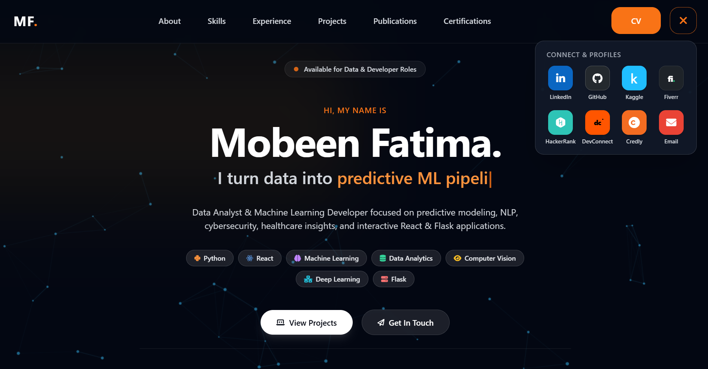

# Mobeen Fatima — Developer Portfolio



A modern, responsive, dark-themed personal portfolio website designed to showcase my expertise as a **Data Analyst & Machine Learning Developer**. The web application features interactive dynamic typography, smooth particle network animations, filtered project showcases, Kaggle publications, certifications track, and integrated social profiles.

**Live Demo:** [mobeenfatima.netlify.app](https://mobeenfatima.netlify.app)

---

## Features

- **Dynamic Hero Section:** Rotating text animations highlighting core domains (Predictive ML, Data Analytics, Computer Vision, Interactive Platforms).
- **Interactive Particle Network Canvas:** Custom HTML5 canvas background responding to user movement.
- **Skills & Domain Breakdown:** Categorized overview of technical capabilities across ML, Deep Learning, Data Science, Web, and Cloud Tools.
- **Filtered Project Showcase:** Interactive category filters for ML, React, and Python/Flask web applications with live links and GitHub repository access.
- **Kaggle Datasets & Publications:** Showcase of published open-source synthetic datasets and analytics notebooks.
- **Interactive Certifications Carousel:** Paginated display of verified industry credentials from IBM, HackerRank, Cognitive Class, and FreeAcademy.
- **Daily Learning Tracker:** Visual tracking across platforms like Kaggle, GitHub, Deep-ML, LeetCode, and Credly.
- **Direct Contact Form & Social Drawer:** Direct message capability via Formspree and Quick-connect profiles drawer.

---

## Tech Stack & Technologies

- **Frontend:** HTML5, Tailwind CSS, JavaScript (ES6+)
- **Styling & UI:** Glassmorphism UI, Custom CSS Animations, FontAwesome Icons
- **Deployment & Hosting:** Netlify
- **Version Control:** Git & GitHub

---

## Repository Structure

```text
.
├── index.html           # Main HTML structure
├── main.js              # Interactivity, particle animations, and page logic
├── tailwind.css         # Custom styles & Tailwind configurations
├── thumbnail.png        # Portfolio thumbnail / preview image
├── Mobeen_Fatima.pdf    # Downloadable CV/Resume
└── images/              # Assets, portfolio previews, and dataset covers
```

## Getting Started

To run this project locally, simply clone the repository and open the `index.html` file in your browser.

### 1. Clone the repository

```bash
git clone https://github.com/MobeenFatima/Portfolio.git
```

### 2. Navigate into the directory

```bash
cd Portfolio
```

### 3. Open in Browser

- Double-click `index.html`
- Or use VS Code's **Live Server** extension.

## Contact & Connect

- **Portfolio:** [mobeenfatima.netlify.app](https://mobeenfatima.netlify.app)
- **LinkedIn:** [linkedin.com/in/mobeen-fatima-59a353247](https://linkedin.com/in/mobeen-fatima-59a353247)
- **Kaggle:** [kaggle.com/mobeenfatimah](https://kaggle.com/mobeenfatimah)
- **GitHub:** [github.com/MobeenFatima](https://github.com/MobeenFatima)
